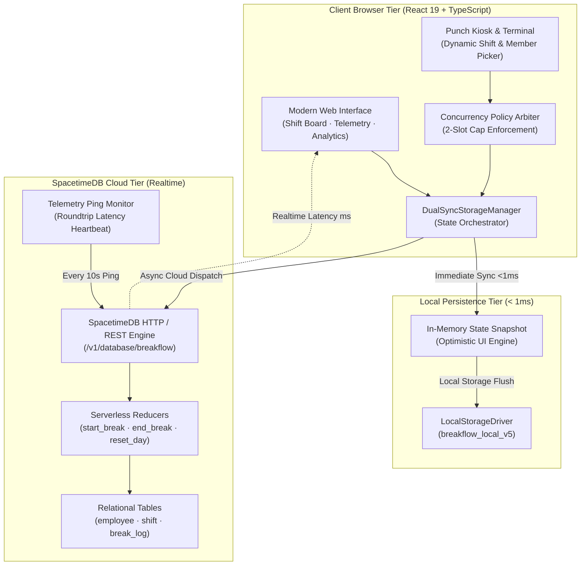
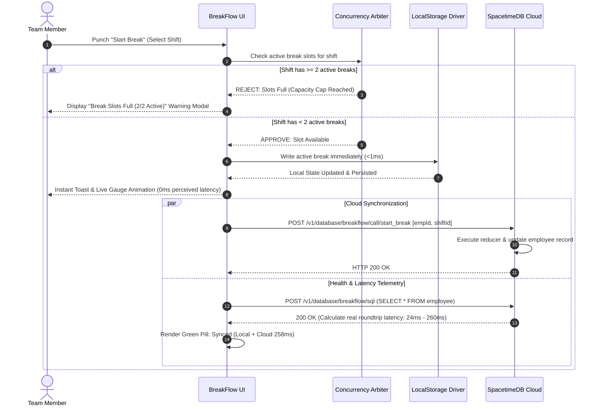
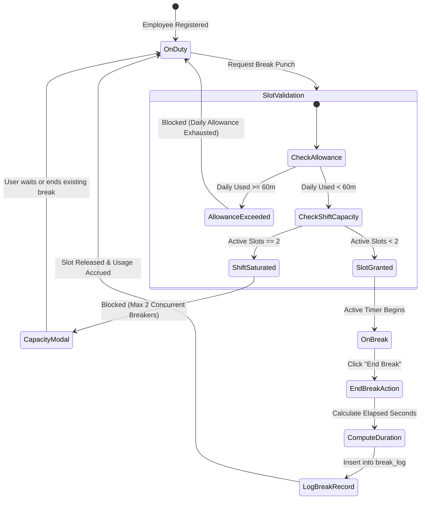

# ⏱️ BreakFlow — Intelligent Workplace Break & Shift Telemetry Platform

<div align="center">

[](https://react.dev)
[](https://www.typescriptlang.org/)
[](https://html.spec.whatwg.org/)
[](https://www.w3.org/Style/CSS/)
[](https://vitejs.dev/)
[](https://spacetimedb.com)
[](https://playwright.dev/)
[](https://github.com/features/actions)
[](https://nodejs.org/)
[](https://greensock.com/gsap/)

<br/>

[](https://github.com/Ashborn-047/breakflow/actions/workflows/deploy-pages.yml)
[](https://github.com/Ashborn-047/breakflow/actions/workflows/e2e.yml)
[](LICENSE)
[]()

<p align="center">
  <strong>BreakFlow</strong> is a high-reliability, real-time workplace break coordination and shift telemetry engine engineered for mission-critical operations. It delivers sub-millisecond local optimistic latency, 2-slot concurrency enforcement, rotating shift rosters, and continuous multi-device cloud synchronization powered by <strong>SpacetimeDB Cloud</strong>.
</p>

</div>

---

## 🏛️ System Architecture & Engineering Design

BreakFlow is engineered as a **dual-tier optimistic telemetry platform**. It guarantees zero UI blocking via instant local persistence while asynchronously coordinating with an in-memory relational cloud database.

### 1. High-Level System Architecture



---

### 2. Dual-Sync State Machine & Data Flow



---

### 3. Concurrency Policy & Slot Lifecycle Invariants

BreakFlow enforces rigorous operational fairness rules across all shifts:



---

## 🌟 Key Features & Capabilities

- **⚡ Zero-Configuration Dual-Sync Engine**:
  - Instant local read/write persistence (<1ms) via `LocalStorageDriver`.
  - Simultaneous cloud synchronization via SpacetimeDB Cloud (`https://maincloud.spacetimedb.com`).
  - Offline-first resilience — all operations function standalone during connectivity interruptions and reconcile automatically upon reconnecting.

- **🛡️ Strict 2-Slot Concurrency Policy**:
  - Enforces a maximum of 2 simultaneous breaks per shift.
  - Saturated shifts trigger an interactive **Capacity Overflow Modal** displaying current active break-takers, elapsed timers, and immediate slot release actions.

- **🔄 Monthly Dynamic Shift Rotation**:
  - Team members rotate through monthly shifts (`Morning shift`, `Afternoon shift`, `Night shift`).
  - Employees are not hardcoded to fixed shifts; team members select their active rotation at punch time.

- **👥 Alphabetical 24-Member Workforce Roster**:
  - All 24 verified team members (`Abhay Mishra` through `Vedika Vivek Bhosle`) seeded alphabetically.
  - Complete roster management interface allowing dynamic team addition, removal, and real-time synchronization.

- **📊 3 Distinct Dynamic Telemetry Dashboards**:
  1. **Live Shift Board**: Real-time slot occupancy, SVG animated countdown gauges, and recent activity audit logs.
  2. **Live Capacity & Telemetry**: Shift load saturation meters, active break-taker telemetry, and capacity headroom.
  3. **Productivity & Analytics**: Live workforce productivity rates, duration distribution histograms, and time filters (`Today`, `This Week`, `This Month`).

- **🎨 Modern Visual Design System**:
  - High-performance Vanilla CSS token system with glassmorphism and subtle elevation.
  - Hardware-accelerated SVG gauge animations powered by GSAP.
  - Instant Dark / Light theme toggle with persisted user preference.
  - Fully responsive on desktop screens, operations terminals, and mobile devices.

- **📥 Universal Data Export**:
  - One-click export to CSV and formatted Microsoft Excel (`.xls`) spreadsheets with shift-scoping filters.

---

## 📁 Repository Structure

```
breakflow/
├── .github/
│   └── workflows/
│       ├── deploy-pages.yml      # Automated GitHub Pages production deployment
│       └── e2e.yml               # Automated Playwright test pipeline
├── e2e/
│   └── break-tracker.spec.ts     # 10 comprehensive end-to-end integration tests
├── public/                       # Static public assets
├── spacetimedb/
│   └── spacetimedb/
│       └── src/index.ts          # SpacetimeDB TypeScript schema & serverless reducers
├── spacetimedb-rust/             # SpacetimeDB Rust module alternative
│   └── src/lib.rs
├── src/
│   ├── components/
│   │   ├── analytics/            # Productivity charts & saturation telemetry
│   │   ├── board/                # Shift cards & real-time slot displays
│   │   ├── common/               # Animated SVG gauges & UI components
│   │   ├── kiosk/                # Break punch terminal & autocomplete
│   │   ├── layout/               # Header with live cloud latency pill & footer
│   │   ├── modals/               # Roster management & export report modals
│   │   └── telemetry/            # Live telemetry dashboard tab
│   ├── hooks/
│   │   └── useBreakTracker.ts    # React state hook & reactive store subscriptions
│   ├── services/
│   │   └── storage/
│   │       ├── IStorageAdapter.ts # Storage interface contract
│   │       ├── LocalStorageDriver.ts # Offline-first local storage driver
│   │       ├── SpacetimeDriver.ts # SpacetimeDB Cloud REST client & heartbeat
│   │       └── index.ts          # DualSyncStorageManager orchestrator
│   ├── types/
│   │   └── index.ts              # Global TypeScript models & 24 team member roster
│   ├── App.tsx                   # Main application router & tab controller
│   ├── index.css                 # Comprehensive CSS design tokens & themes
│   └── main.tsx                  # React 19 entry point
├── playwright.config.ts          # Playwright test configuration with UTC simulation
├── tsconfig.json                 # TypeScript strict compiler configuration
└── vite.config.ts                # Vite 6 build configuration & GitHub Pages base
```

---

## 🗄️ SpacetimeDB Cloud Architecture

- **Database Name:** `breakflow`
- **Host:** `https://maincloud.spacetimedb.com`
- **Console / Dashboard:** [https://spacetimedb.com/breakflow](https://spacetimedb.com/breakflow)

### Database Tables
| Table | Primary Key | Attributes | Description |
| :--- | :--- | :--- | :--- |
| **`employee`** | `id` (String) | `name`, `activeShiftId`, `dailyUsedSeconds`, `activeBreakStartMs` | Workforce members and live break state |
| **`shift`** | `id` (String) | `name`, `hours`, `startHour`, `endHour`, `maxConcurrent` | Shift operating schedules and slot caps |
| **`breakLog`** | `id` (AutoInc U64) | `employeeId`, `employeeName`, `shiftId`, `shiftName`, `startMs`, `endMs`, `durationSec` | Historical telemetry audit records |

### Reducer Functions
- **`start_break(employeeId, shiftId)`**: Atomically checks allowance and shift occupancy before initiating break.
- **`end_break(employeeId)`**: Calculates precise duration, accumulates daily usage, releases slot, and inserts audit log.
- **`register_employee(id, name)`**: Dynamically registers a team member to the cloud roster.
- **`remove_employee(employeeId)`**: Drops employee record from database.
- **`reset_day()`**: Clears active breaks and daily counters for fresh daily operations.
- **`seed_data()`**: Seeds default shifts and all 24 verified team members.

---

## 🧪 Comprehensive E2E Testing

The Playwright test suite in [`e2e/break-tracker.spec.ts`](./e2e/break-tracker.spec.ts) validates real-world operational workflows under strict UTC conditions:

```bash
Running 10 tests using 1 worker

  ✓  1 e2e/break-tracker.spec.ts: 1. Initial Load & Verified Roster Count (812ms)
  ✓  2 e2e/break-tracker.spec.ts: 2. All 24 Team Members Are Sorted Alphabetically (1.1s)
  ✓  3 e2e/break-tracker.spec.ts: 3. Break Punch Lifecycle (Start & End Break) (1.2s)
  ✓  4 e2e/break-tracker.spec.ts: 4. Concurrency Policy Enforcement (2 Slots Max per Shift) (2.2s)
  ✓  5 e2e/break-tracker.spec.ts: 5. Tab Navigation & Telemetry Views (1.4s)
  ✓  6 e2e/break-tracker.spec.ts: 6. Roster Management (Add & Remove Team Member) (1.3s)
  ✓  7 e2e/break-tracker.spec.ts: 7. Dark & Light Theme Toggle & Persistence (1.0s)
  ✓  8 e2e/break-tracker.spec.ts: 8. Reset Day Flow (1.2s)
  ✓  9 e2e/break-tracker.spec.ts: 9. Search Filtering in Kiosk and Shift Board (657ms)
  ✓ 10 e2e/break-tracker.spec.ts: 10. Export Report Modal & Shift Selection (939ms)

  10 passed (16.7s)
```

Run tests locally:
```bash
npm run test:e2e
```

---

## 🚀 Quick Start & Development

### Prerequisites
- [Node.js](https://nodejs.org/) v18 or later
- [npm](https://www.npmjs.com/)

### Installation & Run

1. **Clone the repository**:
   ```bash
   git clone https://github.com/Ashborn-047/breakflow.git
   cd breakflow
   ```

2. **Install dependencies**:
   ```bash
   npm install
   ```

3. **Start local development server**:
   ```bash
   npm run dev
   ```
   Open `http://localhost:5173/` in your browser.

4. **Production build**:
   ```bash
   npm run build
   ```

---

## 🌐 GitHub Pages Deployment & Secrets Guide

### Do you need GitHub Secrets?
> [!NOTE]  
> **NO external secrets are required!**  
> The deployment workflow uses GitHub's built-in `GITHUB_TOKEN` with automatic `pages: write` permissions.

### Enabling GitHub Pages on your repository:
1. Navigate to **Settings** → **Pages** on your repository.
2. Under **Build and deployment** → **Source**, select **GitHub Actions**.
3. Pushes to `main` automatically run the [`deploy-pages.yml`](./.github/workflows/deploy-pages.yml) workflow and publish your site!

---

## 📄 License
This project is licensed under the [ISC License](LICENSE).
